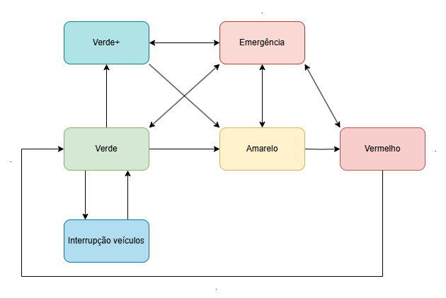

# TEC470 - SISTEMAS EMBARCADOS
Problema 1 da disciplina de Sistemas Embarcados - Semáforo Inteligente.

## Introdução
Um semáforo inteligente é um sistema de controle de tráfego que utiliza sensores, algoritmos e comunicação em tempo real para otimizar o fluxo de veículos e pedestres nas vias urbanas. Diferente dos semáforos tradicionais, que operam com tempos fixos, os semáforos inteligentes ajustam os tempos de sinalização com base em variáveis como intensidade do tráfego, presença de pedestres e veículos de emergência.

As principais características de um semáforo inteligente são:

1. Sensores de fluxo de tráfego: Capitam a quantidade de veículos passando pelo sinal, ajustando o tempo dos sinais conforme necessidade.
2. Prioridades para veículos de emergência: Ao detectar um tipo de veículo específico, como uma ambulância por exemplo, altera o sinal automaticamente para liberar passagem.
3. Detecção de pedestres: Botões e sensores são posicionados com o objetivo de detectar a presença de pedestres, acionando o sinal vermelho quando necessário.
4. Eficiência Energética: Modelos modernos podem usar LEDs de baixo consumo e operar com energia solar, reduzindo custos.

## O Problema

O problema proposto é um semáforo inteligente que deve ser desenvolvido no MCU 8051 e possui os seguintes requerimentos:

- Código deve ser escrito na linguagem assembly;
- O sistema só deve usar os componentes disponíveis no simulador do MCU 8051;
- Além disso, deve atender as seguintes funcionalidades:
    - Tempo de duração dos sinais deve ser de 10 segundos para o Sinal Verde, 3 segundos para o Sinal Amarelo e 7 segundos para o Sinal Vermelho;
    - O tempo deve ser exibido em ordem decrescente no display de 7 segmentos;
    - Deve possuir um modo de emergência ativado por botão, que ativa imediatamente o Sinal Vermelho com duração de 15 segundos;
    - Deve ser feita a contagem de veículos através de um botão, case tenha mais de 5 veículos contados, o sinal verde deve ser estendido para 15 segundos, essa contagem não pode ser feita durante o Sinal Vermelho;
    - A prioridade de interrupções deve seguir a ordem: 1 - Botão de Emergência; 2 - Botão de contagem de carros; 3 - Timer.

## Solução desenvolvida

### Diagrama geral do sistema

- **Figura 1:** *Diagrama geral dos estados do sistema.*

### Estados

O produto gerado possui 3 estados principais controlados por um registrador:
- 1 - Verde: Liga o LED verde e inicia contagem decrescente de 10 segundos, é onde é habilitada a interrupção do botão de contagem de carros, assim como é feito o controle dessa contagem e o devido aumento para 15 segundos caso o contador ultrapasse 5 carros.
- 2 - Amarelo: Liga o LED amarelo, e inicia a contagem decrescente de 3 segundos, a partir desse estado a interrupção do botão de contagem de carros é desabilitada e o contador de veículos é resetado.
- 3 - Vermelho: Liga o LED vermelho e inicia a contagem decrescente de 7 segundos, nesse estado não é possível fazer a contagem de veículos.

Além desses citados acima, existe também dois estados extras cada um com um registrador dedicado:
- 1 - Estado de emergência: nesse estado o LED vermelho é ligado e o contador decrescente é setado em 15 segundos, o estado anterior é salvo pois o mesmo deve retornar após o fim do estado de emergência, pode ocorrer a partir de qualquer estado.
- 2 - Estado de Verde+: esse estado é ativado quando a contagem de veículos é maior que 5, o LED verde continua ligado e o contador de segundos é setado para 15. Esse estado só ocorre a partir do estado Verde, porém, assim como os estados principais, o sistema retorna ao Verde+ caso ele seja interrompido por uma emergência.

### Variáveis em Registradores

A solução desenvolvida faz uso de 7 dos 8 registradores disponíveis no simulados, cada um com uma finalidade específica:

| Registrador   | Utilidade                        | Possíveis Valores e definições         |   
| ------------- | -------------------------------- | -------------------------------------- |
|   R0          | Contador de segundos do Timer    | 0 - 15                                 |
|   R1          | Estador atual                    | 1 = Verde; 2 = Amarelo; 3 = Vermelho   |
|   R2          | Controle de Emergência           | 0 = Normal; 1 = Emergência ativa       |
|   R3          | Estado salvo antes da emergência | 1 = Verde; 2 = Amarelo; 3 = Vermelho   |
|   R4          | Contador de emergência           | 15                                     |
|   R5          | Indicar a flag de Verde+         | 0 = Tempo normal; 1 = Tempo aumentado  |
|   R6          | Contador do número de veículos   | 0 - 255                                |

### Recursos utilizados

O produto desenvolvido faz uso de alguns dos componentes disponívels no simulador MCU 8051

| Componente                           | Porta/Pino                | 
| ------------------------------------ | ------------------------- |
| Primeiro Display de Sete Segmentos   | Porta 1                   |
| Segundo Display de Sete Segmentos    | Porta 0                   |
| Painel de LEDs para cor Verde        | Pino 2.0 (Porta 2, Bit 0) |
| Painel de LEDs para cor Amarela      | Pino 2.1 (Porta 2, Bit 1) |
| Painel de LEDs para cor Vermelha     | Pino 2.2 (Porta 2, Bit 2) |
| Keypad simples (Botão de emergência) | Pino 3.2 (Porta 3, Bit 2) |
| Keypad simples (Botão de contagem)   | Pino 3.3 (Porta 3, Bit 3) |

## Conclusão

A partir dos requisitos do problema, os sinais Verde, Amarelo e Vermelho são ativados corretamente em ordem e com temporizador correto em ordem descrecente, a mudança de estados tanto para o fluxo normal, quanto para os estados ativados por interrupção estão conforme exigidos na descrição atendendo às características de um semáforo inteligente de sensores de fluxo de tráfego e prioridade para veículos de emergência.

Para uma segunda versão, podem ser feitas algumas melhorias, o número de registradores utilizados pode ser reduzido ao usar o mesmo registrador para fazer controle do fluxo normal, estado de emergência e estado verde+, também, o código pode ser reescreito para evitar redundâncias e instruções desnecesárias.

Por fim, o produto gerado, semáforo inteligente desenvolvido na linguem assembly para 8051, atende a todos os requisitos do problema.
